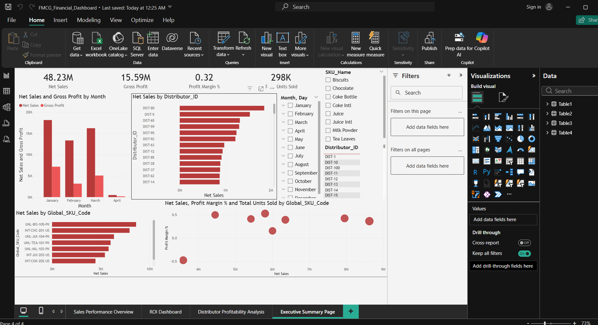
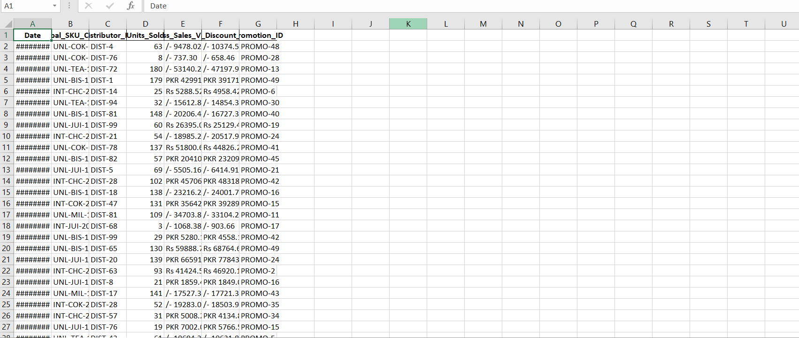
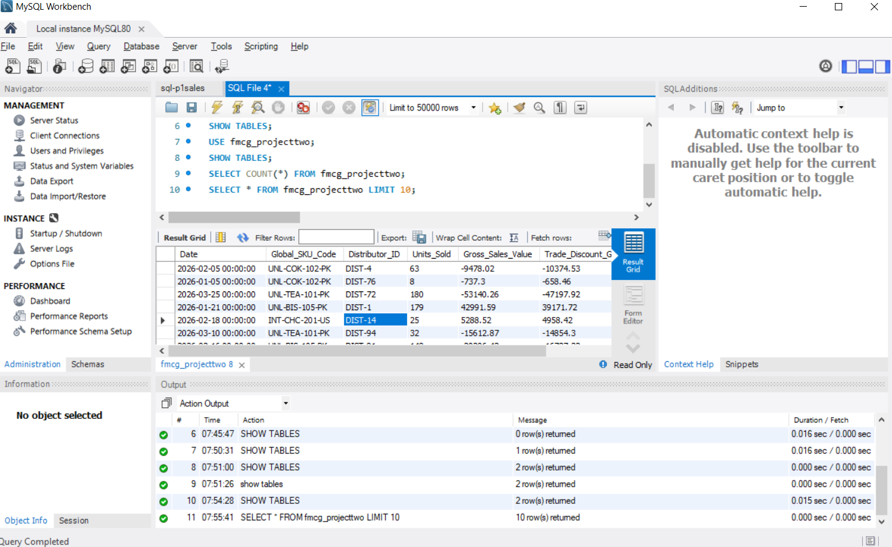
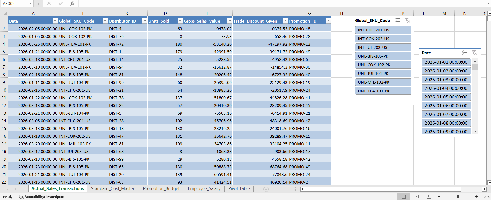

# 🛒 FMCG Financial Intelligence & Sales Analytics
**An End-to-End Data Engineering & BI Solution for Global Retail Operations**

---

## 📌 Executive Summary 
I developed a comprehensive financial data pipeline utilizing **Excel, Python, SQL, and Power BI** to transform fragmented retail sales data into a **"Single Source of Truth"** for global operations.

My workflow involved:
1.  **Excel:** Initial auditing of raw sales exports to identify currency inconsistencies and formatting errors.
2.  **Python:** Engineered an automated ETL script to clean 1,000+ records and normalize regional financial data.
3.  **SQL:** Designing a relational Star-Schema in MySQL to bridge sales transactions with operational costs.
4.  **Power BI:** Delivering an interactive executive suite to monitor SKU profitability and promotional ROI.
---

## 📊 1. Final Executive Dashboard (Power BI)

* **Value Added:** Created high-level KPIs in **Power BI** to provide real-time visibility into Gross Sales, Net Margins, and regional performance across **Pakistan, UAE, and Malaysia**.
---

## 📉 2. Initial Data Auditing (Excel & Raw Data)

**Technical Action:** Conducted a deep-dive audit of the raw FMCG sales exports in **Excel**.
* **Value Added:** Identified critical "dirty data" issues, including inconsistent currency symbols (PKR vs. Rs) and unformatted strings that would skew financial reporting.

---

## 🐍 3. Automated ETL & Cleaning (Python)

**Technical Action:** Developed a **Python** script (Pandas/NumPy) to automate the cleaning of the raw exports shown above.
* **Value Added:** Standardized the dataset by cleaning 1,000+ rows of data, ensuring it was 100% accurate before database migration.
 
---

## 🗄️ 4. Relational Database Migration (SQL)

**Technical Action:** Successfully migrated the cleaned Python output into a **MySQL** relational database.
* **Value Added:** Engineered complex **SQL** joins to calculate true profitability by connecting sales transactions with manufacturing costs and employee overheads.
  
---

## 📈 5. SKU & Market Performance (Cleaned Data View)

**Technical Action:** Utilized the **Cleaned Data** to perform deep-dive analysis on SKU velocity and trade discounts.
* **Value Added:** Isolated **Biscuits (UNL-BIS-105-PK)** as the top performer (4.27M) while identifying profit erosion in underperforming beverage segments.

  
---

## 🛠️ Technical Tech Stack
* **Initial Auditing:** Excel (Data Validation & Structural Checks)
* **Data Engineering:** Python (Pandas, NumPy, Regex for Cleaning)
* **Database Management:** MySQL (Relational Modeling, Joins, Schema Design)
* **Business Intelligence:** Power BI (DAX, Interactive Reporting)
* **Data Volume:** 1,000+ FMCG Transactions
---

